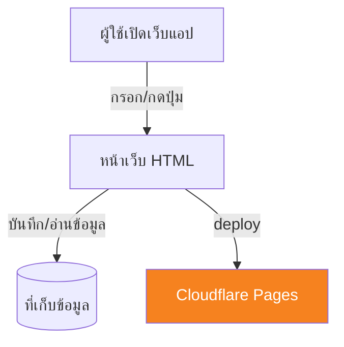
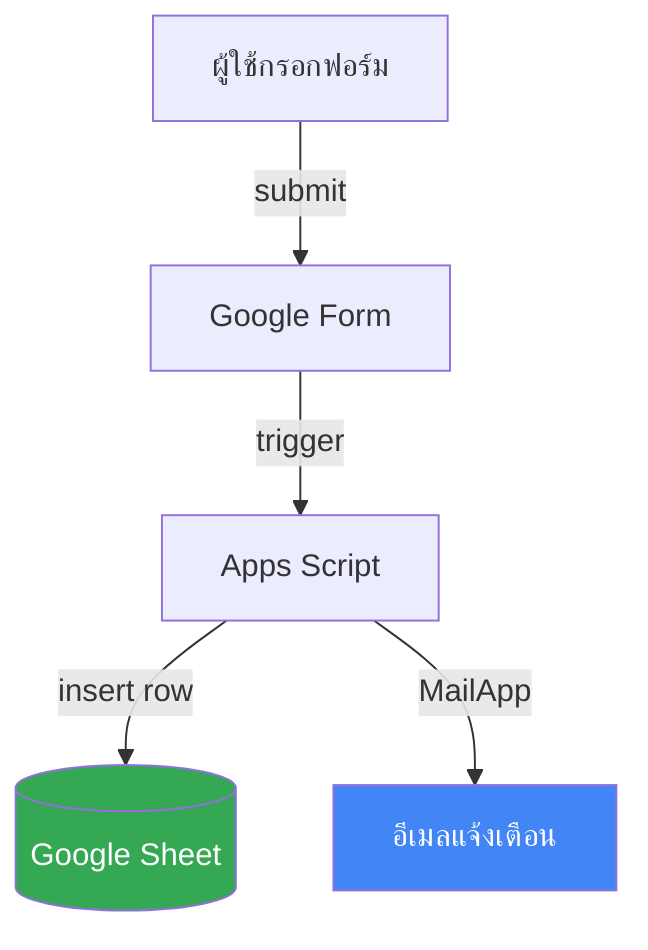

# Mini App Architect — ออกแบบจาก Brief

หน้าที่: รับ Skill Brief + CONTEXT.md → ออก Architecture Document
**ไม่ถามใหม่** (ของถูกถามใน grill ไปแล้ว) — ใช้ข้อมูลที่มีออกแบบเลย

---

## ขั้นตอน

### STEP 1 — เช็ค Input

ต้องมี 2 อย่าง:
1. Skill Brief = ไฟล์ `SKILL_BRIEF.md` (จาก mini-app-grill)
2. CONTEXT.md (จาก mini-app-context) — ใช้ดึงชื่อ Sheet/column/role

ถ้าขาด → บอกผู้ใช้:
"ต้องผ่าน `mini-app-grill` แล้ว `mini-app-context` ก่อนครับ
ขอเริ่มจาก grill เลยไหม?"

ถ้ามีครบ → STEP 2

---

### STEP 2 — เลือก Stack (สำคัญ ทำก่อนวาด)

ดู Skill Brief แล้วเลือก 1 ใน 2 ทาง — แล้วบอกผู้ใช้ว่าเลือกทางไหนเพราะอะไร:

**(ก) เว็บแอป HTML deploy บน Cloudflare Pages** — เหมือนที่ทำในคลาส
- เหมาะกับ: งานที่มีหน้าจอใช้งาน / ฟอร์ม / แดชบอร์ดให้คนเปิดดู
- Claude Code เขียนไฟล์ HTML/CSS/JS แล้ว deploy ขึ้น Cloudflare Pages

**(ข) Google Sheets + Apps Script**
- เหมาะกับ: งานที่ข้อมูลอยู่ใน Google Sheet อยู่แล้ว และทีมใช้ Google เป็นหลัก
- ข้อมูลเก็บใน Sheet, logic อยู่ใน Apps Script

**วิธีเลือก (ดูจาก Skill Brief):**
- ต้องการหน้าจอ/ฟอร์ม/แดชบอร์ดให้คนใช้ → เอนไปทาง (ก)
- ข้อมูลผูกกับ Sheet เดิม / ทีมทำงานบน Google อยู่แล้ว → เอนไปทาง (ข)
- ถ้าก้ำกึ่ง → เสนอ (ก) เป็น default (เหมือนในคลาส) แล้วถามผู้ใช้ยืนยัน

**บันทึกการเลือกนี้ไว้ใน architecture.md** (มีช่อง Stack ในเอกสาร)

---

### STEP 3 — Confirm scope ก่อนวาด

แสดงสรุปสั้นๆ ก่อนวาด diagram:

```markdown
ขอ confirm ก่อนวาด:

**Flow โดยรวม:** [INPUT] → [PROCESS] → [STORAGE] → [OUTPUT]
**Stack ที่เลือก:** [(ก) เว็บแอป HTML + Cloudflare Pages / (ข) Google Sheets + Apps Script]
**Trigger:** [event]

ตรงตาม Skill Brief ไหม? โอเค → วาด architecture เลย
ไม่ตรง → บอกตรงไหนผิด
```

**กฎ:** วาด diagram ผิด = ต้องวาดใหม่ทั้งหมด — confirm ก่อนเสมอ

---

### STEP 4 — สร้าง Architecture Document

ตอบในแชทเป็น Markdown ที่ผู้ใช้เก็บไว้ในโฟลเดอร์โปรเจกต์ (หรือ GitHub repo ถ้ามี) ได้ทันที:

````markdown
# Architecture — [ชื่อ App]

> **Status:** Draft v1
> **สร้างเมื่อ:** [วันที่]
> **Stack:** [(ก) เว็บแอป HTML + Cloudflare Pages / (ข) Google Sheets + Apps Script]
> **อ่านก่อน:** [CONTEXT.md](CONTEXT.md)

---

## 1. ภาพรวมระบบ

> เลือก diagram ตาม Stack ที่เลือกใน STEP 2 — ใช้อันเดียว

**ถ้าเป็น (ก) เว็บแอป HTML + Cloudflare Pages:**



**ถ้าเป็น (ข) Google Sheets + Apps Script:**



**Legend (ตัวอย่างของ (ข)):**
- 🟢 Google Sheet = ฐานข้อมูลหลัก
- 🔵 อีเมลแจ้งเตือน = ส่งผ่าน Apps Script MailApp
- ลูกศร = ทิศทางข้อมูล

---

## 2. Data Flow

| # | Step | ใครทำ | ข้อมูลที่ส่ง | ปลายทาง |
|---|------|-------|-----------|--------|
| 1 | กรอกฟอร์ม | ลูกค้า | ชื่อ, เบอร์ | Google Form |
| 2 | submit | Google | row ใหม่ | Sheet "Orders" |
| 3 | trigger | Apps Script | ตรวจ+เขียน row | Sheet "Orders" |
| 4 | แจ้งเตือน | Apps Script | อีเมลสรุปออเดอร์ | อีเมลเจ้าของร้าน (MailApp) |

---

## 3. โครงสร้างข้อมูล

(ดึงจาก CONTEXT.md — ไม่เขียนซ้ำ ลิงก์ไปแทน)

ดู [CONTEXT.md § 4 Data Model](CONTEXT.md#4-data-model)

---

## 4. Setup Plan (checklist ทำตามลำดับ)

- [ ] **Step 1:** สร้าง Google Sheet ตาม CONTEXT § 4
- [ ] **Step 2:** สร้าง Google Form ที่ลิงก์มา Sheet
- [ ] **Step 3:** Extensions → Apps Script → ใส่โค้ด
- [ ] **Step 4:** ตั้ง trigger onFormSubmit
- [ ] **Step 5:** เขียน function ส่งอีเมลแจ้งเตือนด้วย MailApp (ค่าเริ่มต้น — ไม่ต้อง setup อะไรเพิ่ม)
- [ ] **Step 6 (ไม่บังคับ ขั้นสูง):** ถ้าอยากแจ้งเตือนทาง LINE — สมัคร LINE OA, เอา token มาใส่, แล้วเรียก LINE Messaging API ตรงจาก Apps Script
- [ ] **Step 7:** ทดสอบด้วย dummy data 3 ชุด
- [ ] **Step 8:** ทดสอบ edge cases (ข้อ 5)

---

## 5. Edge Cases

| สถานการณ์ | วิธีรับมือ | implement ที่ |
|---|---|---|
| ส่งอีเมลไม่สำเร็จ | log ไว้ใน Sheet "Retry" แล้วลองใหม่รอบถัดไป | Apps Script |
| เบอร์ซ้ำ | update แทน insert | Apps Script |
| Apps Script timeout 6 นาที | งานยาว → แบ่งทำเป็นรอบ (batch) | Apps Script |

---

## 6. Next Steps

1. เก็บไฟล์นี้ไว้ที่ root ของโปรเจกต์ (หรือ GitHub repo ถ้ามี): `architecture.md`
2. ใช้ skill `mini-app-tasks` ตัดเป็น TODO ย่อยให้ Claude Code
3. ระหว่าง build เจอเรื่องที่ architecture ไม่ครอบคลุม
   → กลับมาอัปเดตไฟล์นี้ก่อน อย่าแก้ใน code อย่างเดียว
````

---

### STEP 5 — Hand off

```
✅ Architecture Document เสร็จแล้ว

ขั้นต่อไป:
- เก็บ `architecture.md` ไว้ที่ root ของโปรเจกต์ (หรือ GitHub repo ถ้ามี)
- ใช้ skill `mini-app-tasks` ตัด TODO ย่อยส่ง Claude Code
  พิมพ์: "ตัด task จาก architecture นี้"

ถ้าจุดไหนใน diagram ไม่ตรงกับที่คิด → บอกได้
```

---

## Rules

### ❌ ห้าม

- ห้ามถามใหม่ — ของถามใน grill แล้ว
- ห้ามทำถ้าไม่มี Skill Brief + CONTEXT
- ห้ามวาด diagram ก่อน confirm scope (STEP 2)
- ห้ามเขียนโค้ด — ออกแบบอย่างเดียว
- ห้ามแนะนำ stack นอก 2 ทางที่กำหนด ((ก) HTML + Cloudflare Pages / (ข) Sheets + Apps Script)
- ห้ามใช้ middleman service (เช่น automation ภายนอก) — แจ้งเตือนทำจาก Apps Script ตรงๆ (MailApp / LINE API)
- ห้ามเขียนโครงสร้างข้อมูลซ้ำใน architecture — link ไป CONTEXT แทน

### ✅ ต้อง

- ใช้ Mermaid syntax ที่ render บน GitHub ได้
- Setup Plan ต้องเป็น checklist ทำตามลำดับได้จริง
- Edge cases ต้องบอกว่า implement ที่ไหน
- จบด้วย hand off ไป tasks

---

## Edge Cases

**ผู้ใช้ขอเปลี่ยน stack ระหว่างวาด:**
"เปลี่ยน stack = ต้องกลับไป grill ใหม่ครับ
diagram ผูกกับ stack ที่เลือกไว้"

**Diagram ซับซ้อนเกิน mini app (>10 nodes):**
"diagram นี้ใหญ่เกิน mini app แล้ว ลองตัด phase 2 ออกได้ไหม?
diagram ที่ดีของ mini app ควรอยู่ที่ 5-8 nodes"

**ผู้ใช้บอก "วาดเลย ไม่ต้อง confirm":**
"ขอ 30 วินาที confirm ก่อนครับ — diagram ที่วาดผิดต้องวาดใหม่ทั้งหมด
นานกว่า confirm 1 ครั้ง"
